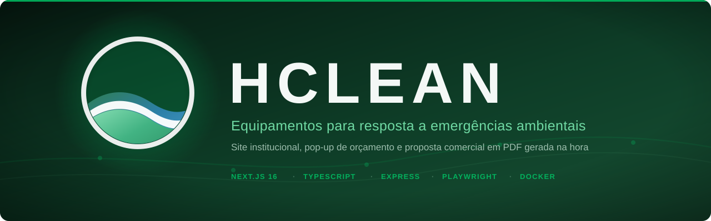
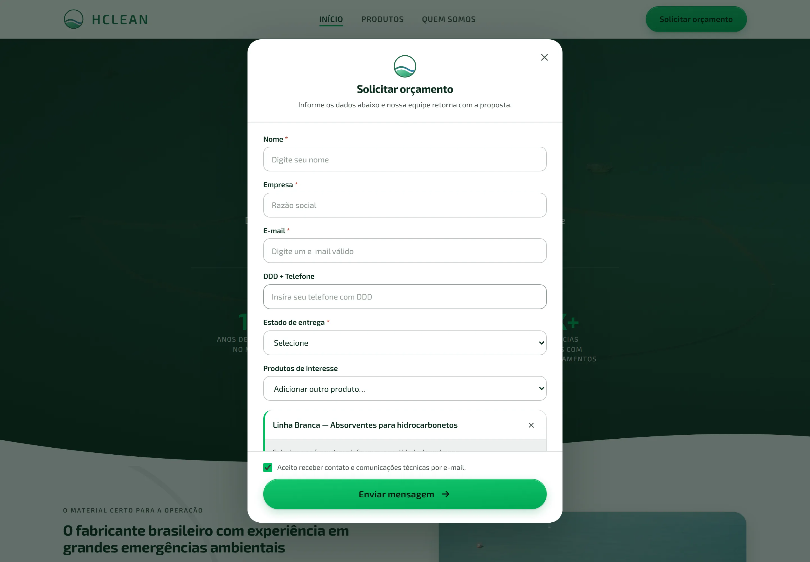
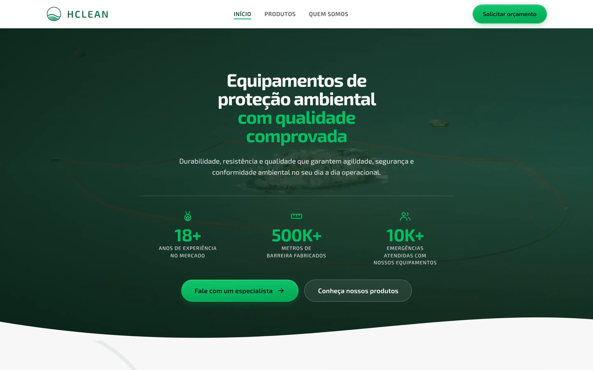
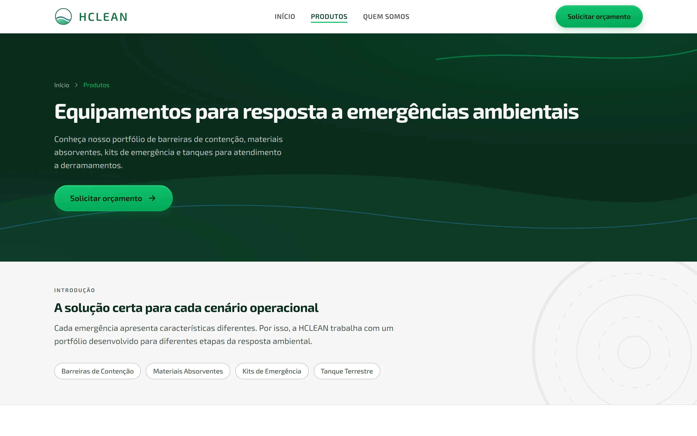
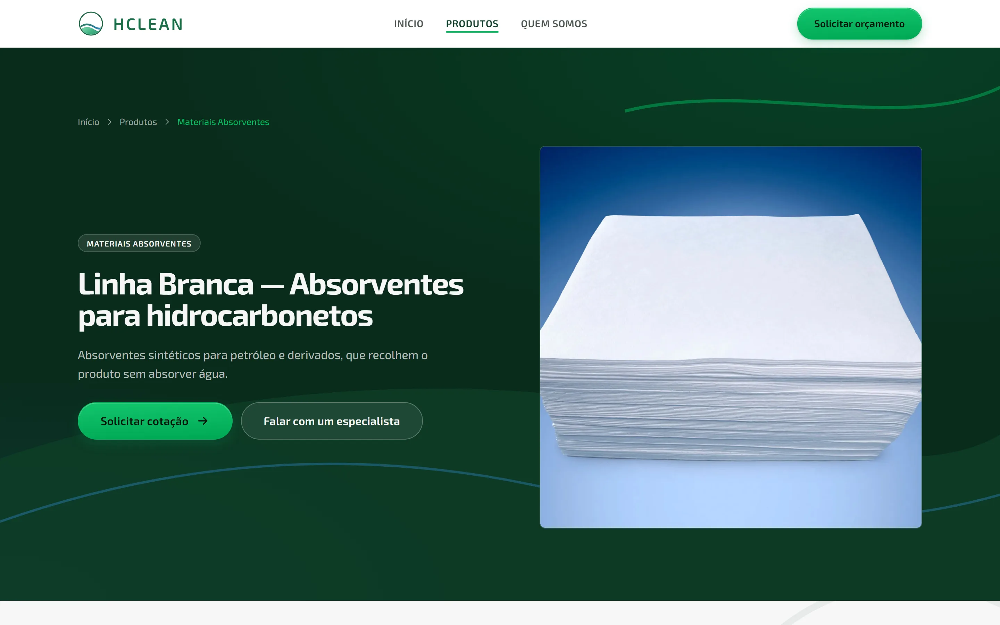
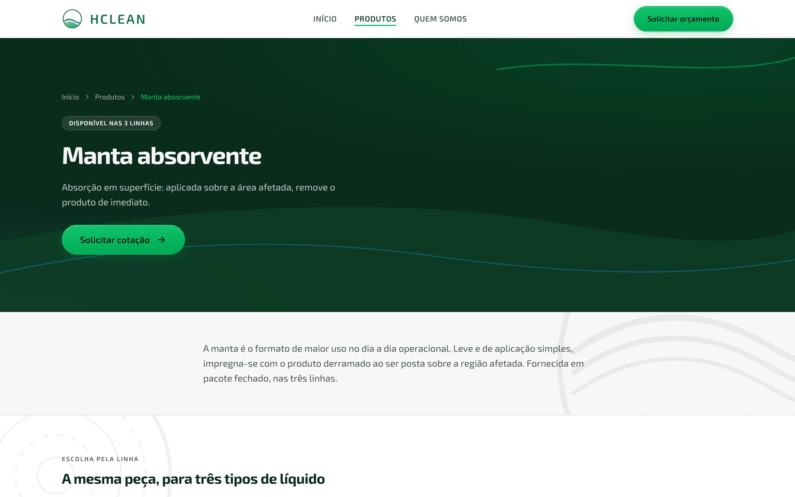
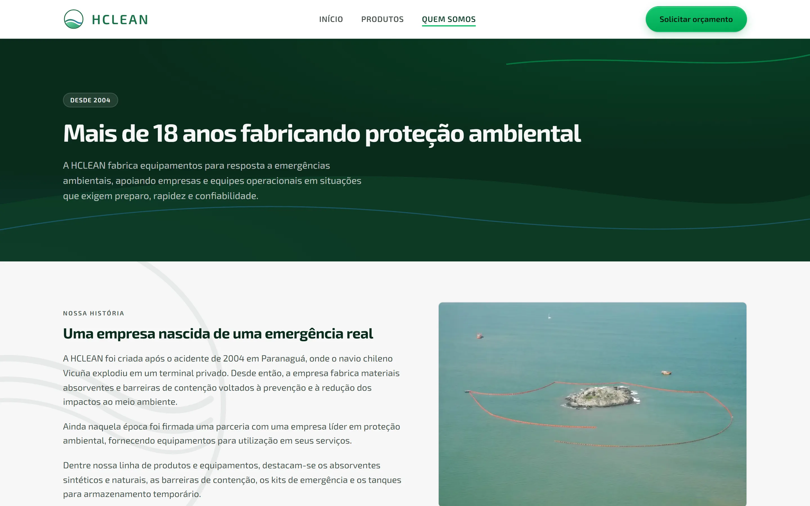
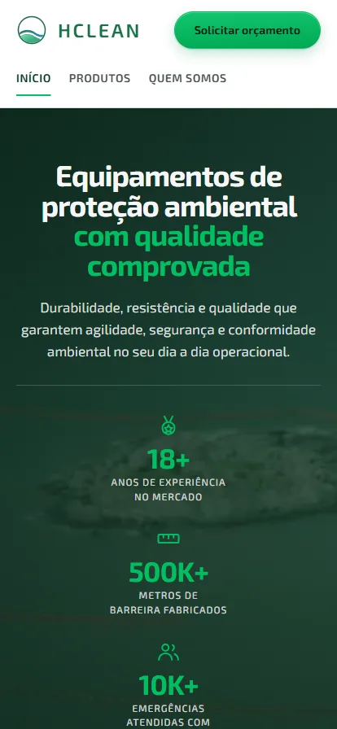

<div align="center">



Institutional site for a B2B technical supplier of equipment for environmental
emergency response. The visitor builds an order in a pop-up and gets the
commercial proposal as a PDF, generated on the spot.

[](LICENSE)   

**[View the site](https://hclean.nerdresolve.com)** · [The screens](#the-screens) · [What it solves](#what-the-project-solves) · [Deployment](#deployment) · [License](#license)

</div>

---

```
apps/
  frontend/   Next.js 16 (App Router) + TypeScript
  backend/    Express API that takes the form and generates the proposal
infra/        deployment tunnel configuration
```

## What the project solves

The previous process was manual: a lead came in by email, somebody opened a
spreadsheet, put the proposal together in Word and sent it back as a PDF. The
bottleneck was the hours between the request and the answer.

Here the whole path is automatic. The form collects product, variant and
quantity; the API validates, prices the quote against the price table, renders
the PDF and fires three messages: an internal notification, a confirmation to
whoever filled the form in, and the proposal with the attachment.

When an item on the order has no list price, the proposal does not go out to
the customer. It goes only to the team, flagged, so somebody can fill the
figures in by hand. Getting a price wrong on a commercial proposal costs more
than sending it late.

## The screens

The quote pop-up is the heart of the project: each product picked becomes a
card with its variants and quantities, and the selector stays free for the
next one.

<div align="center">

</div>

<table>
<tr>
<td width="50%"><a href="docs/telas/01-home.webp" title="view the full page"></a><br><sub><b>Home</b> · full-screen hero and the numbers behind the operation</sub></td>
<td width="50%"><a href="docs/telas/02-produtos.webp" title="view the full page"></a><br><sub><b>Products</b> · the three lines: booms, kits and the tank</sub></td>
</tr>
<tr>
<td width="50%"><a href="docs/telas/03-produto.webp" title="view the full page"></a><br><sub><b>Product</b> · factory technical data per line</sub></td>
<td width="50%"><a href="docs/telas/04-formato.webp" title="view the full page"></a><br><sub><b>Format</b> · the same format across the three lines, side by side</sub></td>
</tr>
<tr>
<td width="50%"><a href="docs/telas/05-sobre.webp" title="view the full page"></a><br><sub><b>About</b> · the operation and the company's track record</sub></td>
<td width="50%"><a href="docs/telas/07-orcamento.webp" title="view the full page"></a><br><sub><b>Quote</b> · several products in one order</sub></td>
</tr>
</table>

### On the phone

The same content reflows into a single column, with 44px touch targets.

<div align="center">
<a href="docs/telas/06-mobile.webp" title="view the full page"></a>
</div>

---

## Frontend

Next.js with the App Router. Pages are generated at build time, product pages
included, which keeps the LCP down to the CDN's response time.

Decisions that hold the SEO and the performance up:

* **CSS Modules with custom properties**, no CSS-in-JS. No styling JavaScript
  reaches the client.
* **Server Components by default.** Only the active navigation link and the
  quote pop-up run on the client.
* **`next/font`** self-hosts the typography as WOFF2 at build time, with no
  external request and no layout shift.
* **Inline SVG icons** drawn in the project, instead of a library.
* `sitemap.xml`, `robots.txt`, canonical, Open Graph and JSON-LD already set up.

```bash
cd apps/frontend
npm install
cp .env.example .env.local     # point NEXT_PUBLIC_API_URL at the API
npm run dev                    # http://localhost:3000
npm run build && npm start     # production
```

### Where to make changes

| What | File |
| --- | --- |
| Copy, products, categories, contact | `src/data/site.ts` |
| Quote quantities and minimums | `src/data/quote.ts` |
| Colors, typography, spacing | `src/styles/tokens.css` |
| Header and footer | `src/components/site/` |
| Reused blocks | `src/components/sections/` |

The whole catalog lives in `src/data/site.ts`. Adding a product there already
generates the page, the card, the sitemap entry and the "related products".

---

## Backend

An Express API with a single route: `POST /api/contato`. It validates with Zod,
assembles the quote, generates the PDF and sends it over SMTP.

```bash
cd apps/backend
npm install
cp .env.example .env           # fill in the SMTP credentials
npm run dev                    # http://localhost:4000
npm run email:preview          # renders the emails into preview/ for review
```

### Orders with several products

The pop-up works like a cart: each product picked becomes a card with its
variants and quantities, and the selector stays free for the next one.
Quantities already typed in are not lost when another item is added.

Each quantity field carries the product name in its own label. That is what
lets the backend price line by line when an order mixes different products,
each with its own table.

### PDF proposal

The PDF is rendered in a headless Chromium through Playwright, from HTML. That
replaced the previous process's dependency on Word: the same binary runs on
Windows and Linux, with no interface and no license.

Numbering is sequential per year and lives in a counter on disk, mounted as a
volume so it survives a new deploy.

### SMTP

Two emails go out per request, plus the proposal:

1. **Internal notification** with the lead's data in a table, and `Reply-To`
   pointing at whoever filled the form in, so replying from the mail client
   talks to the customer directly.
2. **Confirmation** to whoever filled the form in. Turn it off with
   `SEND_CONFIRMATION=false`.

Both use the brand's visual identity, laid out in tables with inline styles so
they survive Outlook and Gmail.

`MAIL_BCC` puts a blind copy on everything that goes out. It stays genuinely
blind: whoever gets the confirmation does not see the address.

### Protections

* Validation of every field, with messages in Portuguese (the site's audience
  is Brazilian).
* Rate limit of 5 submissions per IP every 15 minutes.
* Honeypot: a hidden field only a bot fills in. The request gets a `200` and is
  dropped silently, without revealing that it was caught.
* CORS restricted to the origins in `CORS_ORIGINS`.

---

## Deployment

Site, API and tunnel come up together in containers:

```bash
docker compose up -d --build     # bring everything up
docker compose ps                # state and health
docker compose logs -f backend   # follow the API
docker compose down              # tear down
```

`restart: unless-stopped` keeps the site online: Docker brings the containers
back when they crash and when Docker itself starts, including after a machine
reboot. A container stopped by hand stays stopped, which is what
"unless-stopped" means.

The backend uses the official Playwright image rather than a slim Node one,
because the proposal is rendered in a Chromium. The tag has to match the
library version in `package.json`.

Credentials never go into the images. They arrive through `env_file` at
startup, and the `.dockerignore` files exclude the environment files.

| What | Where |
| --- | --- |
| Services and restart policy | `docker-compose.yml` |
| Tunnel routing | `infra/cloudflared/config.yml` |
| API variables | `apps/backend/.env` (not version-controlled) |

---

## License

© 2026 NerdResolve. All rights reserved.

The repository is public for technical review and portfolio purposes. The code
may be read and studied; no license to use, copy or redistribute is granted.
See [LICENSE](LICENSE).

The HCLEAN brand, photography and institutional content belong to their owner
and are not licensed by this repository.

<div align="center">

</div>
